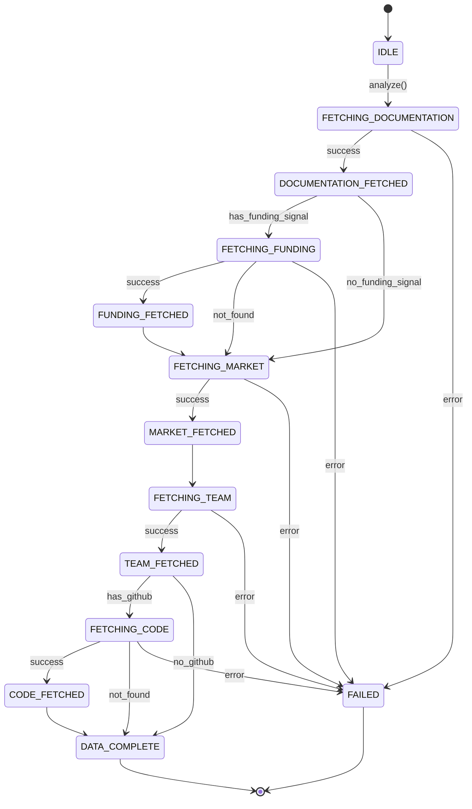
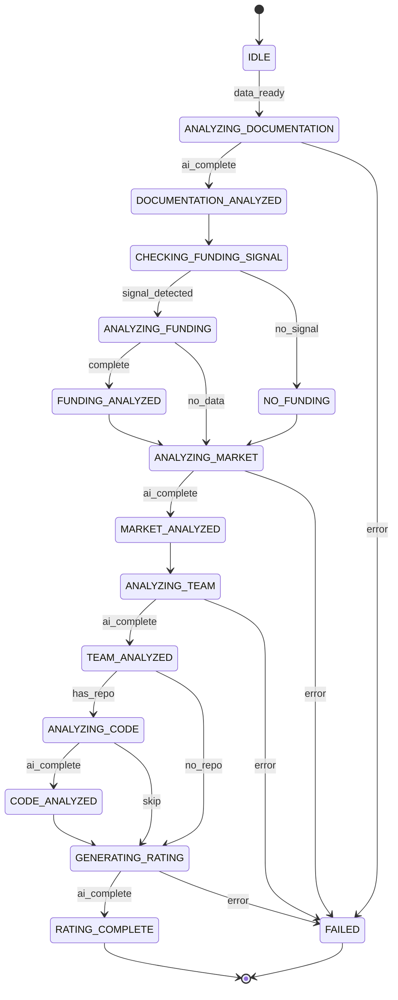
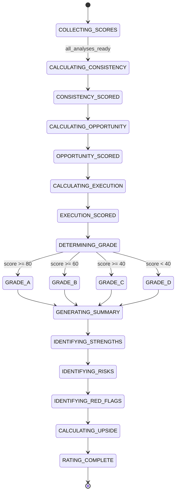
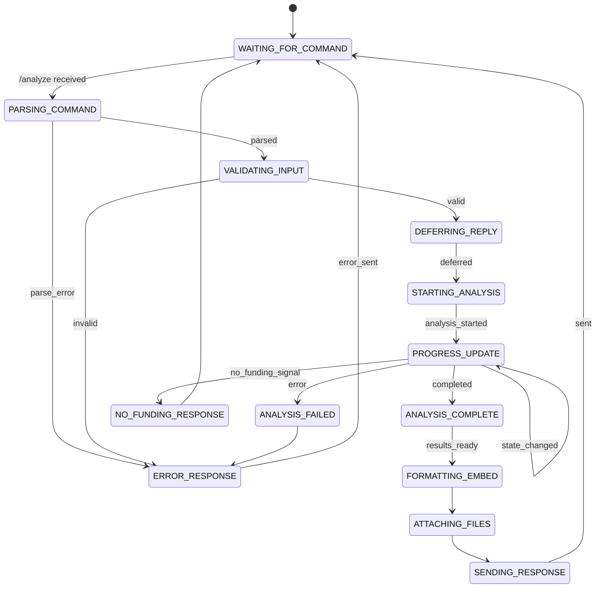
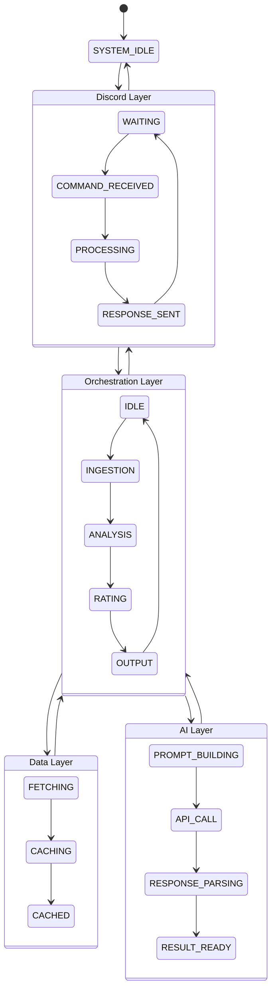

# Alpha Screener State Machine Diagrams

## 1. Data Ingestion State Machine

## 2. Analysis Pipeline State Machine

## 3. Rating Generation State Machine

## 4. Discord Bot Interaction State Machine

## 5. Complete System Flow

## State Descriptions

### Analysis States
| State | Description |
|-------|-------------|
| IDLE | System waiting for analysis request |
| FETCHING_DOCUMENTATION | Retrieving project documentation from URL |
| ANALYZING_DOCUMENTATION | AI processing documentation content |
| CHECKING_FUNDING_SIGNAL | Evaluating if funding data should be fetched |
| FETCHING_FUNDING | Querying Messari/CryptoRank APIs |
| ANALYZING_FUNDING | Processing funding round data |
| FETCHING_MARKET_DATA | Querying CoinGecko/CMC APIs |
| ANALYZING_MARKET | AI evaluating market opportunity |
| FETCHING_TEAM_DATA | Extracting team information |
| ANALYZING_TEAM | AI evaluating team background |
| FETCHING_CODE | Querying GitHub API |
| ANALYZING_CODE | AI evaluating repository metrics |
| GENERATING_RATING | AI producing final scores and grade |
| FORMATTING_OUTPUT | Generating JSON and Markdown |
| COMPLETED | Analysis finished successfully |
| FAILED | Analysis encountered error |
| NO_FUNDING | No funding signal detected in docs |

### Transitions
All state transitions are logged with timestamps for debugging and performance monitoring.
